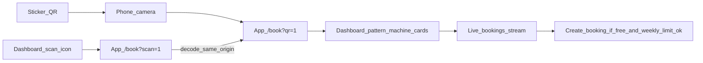

# Plan: QR-assisted booking, dual dashboard actions, and week-long slots

## Overview

QR scan opens a live panel listing all machines with today’s **before / current / after** slot owners (name + room); manager-printable QR stickers; dashboard scan icon; dual **Book Now** + **countdown** actions; week-long booking with automated tests (timeline helper, URLs, RTL).

## Checklist

- [ ] Add `buildMachineBookUrl`, `getResidentBookingWeekContext`, `getMachineSlotNeighbors` + Vitest coverage
- [ ] BookingFlow: drop schedule gate; fix `dateOptions`; QR landing reuses Dashboard machine glass-panel grid; before/now/after inside each card; timeline helper tests
- [ ] Dashboard: header scan icon; split Main Action into Book Now + countdown status; align Booked/week with helper; RTL tests
- [ ] ManagerPanel + `PrintMachineQr` route/page; QR generation + print CSS; wire `App.tsx` route
- [ ] (Optional) `resident-create-booking` reject when `forceCloseBookings` + small function test

---

## Assessment

**Firestore** already enforces one slot / one owner and one booking per student per week (`createBooking` in `src/services/firestoreService.ts`, `netlify/functions/resident-create-booking.js`). **UI-only gating** is the main limitation: `BookingFlow.tsx` blocks the whole page when `!isNextWeekOpen` (unless `forceCloseBookings`), and `Dashboard.tsx` collapses the main CTA when `isSystemClosed`.

**Assumption:** Printed QR stickers (URL) plus a dashboard scan affordance; in-app `BarcodeDetector` when available, with fallback instructions.

---

## 1. QR landing: four machines, before / current / after owners

**Requirement:** After scan, show **every machine** with **three neighbor slots around “now”** on **today’s Belarus date**: previous `TIME_SLOTS` entry, current interval (contains now), next entry. Show **`studentName` + `roomNumber`**, or **Free**.

**Rules:**

- **Current slot:** Same as live “in use” in `getMachineRealTimeStatus` (`Dashboard.tsx` ~753–761): now strictly after `startTime` and before `startTime + SLOT_DURATION_MINUTES` (`SLOT_DURATION_MINUTES` in `src/types.ts`).
- **Before / after:** Adjacent indices in `TIME_SLOTS` for that day on that machine.
- **Data:** `bookings` where `date === formatBelarusDate(today)`, grouped by `machineId` + `startTime`.

**URLs:**

- **Shared laundry QR:** `/book?qr=1`
- **Per-machine sticker:** `/book?qr=1&machine=<id>` — same overview, scroll/highlight that machine.

**UI:** Reuse **Dashboard “Machine Status – Live View”** (`Dashboard.tsx` ~1374–1477, cards ~1463+): `grid-cols-2` glass-panel cards, same typography and muted secondary text; inside each card, **Before | Now | After** strip. Prefer a shared presentational block (`MachineNeighborSlots` / card shell) or mirror styles in one PR and dedupe later. Render **at top of `BookingFlow`** when `qr` is set; full week booking UI below. Live streams refresh neighbors.

**Helper:** `getMachineSlotNeighbors(...)` — shared by UI and Vitest.

---

## 2. Manager panel: print machine QR codes

- New affordance in `ManagerPanel.tsx` (~714–725): **Print machine QR** (optional password gate like Print Codes).
- Route e.g. `/manager/print-qr` → `src/pages/PrintMachineQr.tsx`: load machines via `firestoreService.getMachines`; print **shared** `${origin}/book?qr=1` and optional per-machine `${origin}/book?qr=1&machine=<id>`; use `qrcode` or `react-qr-code`; print CSS like `PrintSchedule.tsx`.

---

## 3. Dashboard: scan icon + dual student actions

- **Scan icon** in header (~1241–1296): navigate to `/book?scan=1`; on decode, land with `qr=1` where appropriate; same-origin `/book` only.
- **Two controls** in main action panel (~1320–1371): **Book Now** (→ `/book`; **Booked** when student has booking for target week) + **Status / next window** (countdown using `getNextAutoOpenDate` / `getAutoOpenWindowDisplay`).
- Keep **Active / Closed** semantics for `forceCloseBookings`; clarify copy if “closed” is only legacy window.

---

## 4. Booking policy: open the week, live data

- Do **not** block `/book` on `!isNextWeekOpen` when `forceCloseBookings` is false (`BookingFlow.tsx` ~666+).
- **Date strip:** Replace next-week-only jump in `dateOptions` (~378–398) with e.g. **today through end of current Belarus week** (`max(today, weekStart)` … `weekEnd`), maintenance day respected in UI.
- Align `slotCapacity`, `hasBookedForNextWeek`, and BookingFlow with **`getResidentBookingWeekContext(now, settings)`**.
- **Optional:** Server-side `forceCloseBookings` check in `resident-create-booking.js`.

---

## 5. Optional: selected-day strip in full booking grid

Optional compact **Before | Now | After** using the same `MachineNeighborSlots` styles when picking date/machine in normal booking mode.

---

## 6. Automated tests

| Area | Tests |
|------|--------|
| URL builder | `buildMachineBookUrl` |
| Week context | `getResidentBookingWeekContext` |
| Timeline | `getMachineSlotNeighbors` edge cases |
| Time utils | Countdown / `getNextAutoOpenDate` if extracted |
| Dashboard RTL | Book + Status + scan navigation |
| BookingFlow RTL | `?qr=1` overview + test id |

---

## 7. Flow

---

## Implementation order

1. Helpers + unit tests (`getMachineSlotNeighbors`, week context, URLs).
2. Shared UI / QR overview on `BookingFlow` (`qr=1`) matching Dashboard cards.
3. BookingFlow: remove schedule gate, `dateOptions`, query params.
4. Dashboard: scan icon, dual CTAs, tests.
5. Manager: `PrintMachineQr` + route.
6. (Optional) Server kill switch on create booking.
